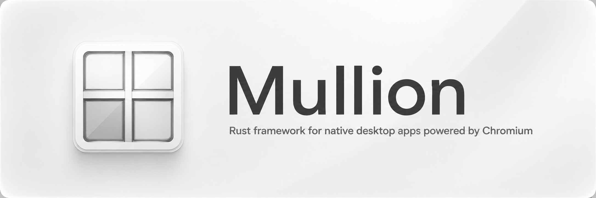

# Sabine

Sabine is a native application framework built around one shared Chromium runtime.
Write your UI in the web stack you already use, keep a real desktop window, and share one
browser engine across every Sabine app on the machine.

## Install

```toml
[dependencies]
sabine = { git = "https://github.com/Lantharos/Sabine" }
```

```sh
cargo install --git https://github.com/Lantharos/Sabine sabine-cli
cargo install --git https://github.com/Lantharos/Sabine sabine-service
```

For the TypeScript helpers used by the web UI:

```sh
bun add github:Lantharos/Sabine#path:packages/sabine
```

## Why Sabine

- One shared Chromium runtime across Linux, Windows, and macOS
- Native windows with GPU composition, glass materials, trays, and palettes
- Guests for embedded tabs, previews, auth flows, and untrusted pages
- Typed Rust ↔ web bridge with explicit command and origin permissions
- Shared service that owns first-run setup, the Chromium runtime, and future tools
- Visible progress while the first app prepares the machine for every Sabine app
- One `Sabine.toml` for app identity, web assets, and packaging
- Lifecycle controls for background windows, tray apps, and browser-style workloads
- TypeScript package for invoke, guests, window controls, activity, and popups

## Quick start

```sh
sabine new my-app
cd my-app
sabine dev
```

Generated apps look like this:

```rust
use sabine::prelude::*;
use serde::{Deserialize, Serialize};

#[derive(Deserialize)]
struct VersionRequest {}

#[derive(Serialize)]
struct VersionResponse {
    version: &'static str,
}

fn main() {
    let manifest = std::path::PathBuf::from(env!("CARGO_MANIFEST_DIR")).join("Sabine.toml");
    SabineWindow::main(|window| {
        Ok(window
            .with_manifest(manifest)?
            .app()
            .size(960, 640)
            .bridge_typed("app.version", |_request: VersionRequest| {
                Ok(VersionResponse {
                    version: env!("CARGO_PKG_VERSION"),
                })
            }))
    });
}
```

```js
import { invoke, guest, appWindow, listen } from "@lantharos/sabine";

const { version } = await invoke("app.version");
listen("tray.click", () => appWindow.show());

const tab = await guest.create({
  url: "https://example.com",
  bounds: { x: 16, y: 64, width: 900, height: 600 },
  partition: "persist:browser",
});
```

On first launch (or `sabine dev`), Sabine prepares the shared Chromium runtime when it is missing
(with progress). App launches also register with the shared Sabine service. Later runs adopt that
install and open immediately. If the service binary is missing, Sabine tries GitHub Releases first,
then falls back to `cargo install --git` (Rust must be installed) until release binaries are published.

## Window recipes

```rust
// Standard desktop app
SabineWindow::new().app();

// Transparent palette or launcher
SabineWindow::new().palette();

// Background tray app
SabineWindow::new()
    .tray_app()
    .tray_icon(/* ... */)
    .single_instance_id("com.example.my-app");

// Custom titlebar and sidebar glass regions
SabineWindow::new()
    .frameless()
    .glass()
    .app_chrome(AppChrome::new(38, 260));
```

Embed another page as a guest surface:

```js
import { guest } from "@lantharos/sabine";

const surface = await guest.create({
  url: "https://example.com",
  bounds: { x: 16, y: 64, width: 900, height: 600 },
  partition: "persist:browser",
  allowBridge: false,
});
await surface.setBounds({ x: 16, y: 64, width: 1100, height: 700 });
```

## Configuration

`Sabine.toml` describes the app and its web assets. The CLI uses it for install and packaging;
Rust can load the same file with `with_manifest`:

```toml
[app]
id = "com.example.my-app"
name = "My App"
version = "1.0.0"
icon = "assets/icon.png"

[web]
root = "ui"
dist = "ui/dist"
entry = "ui/dist/index.html"
dev_url = "http://localhost:5173"
build = "bun run build"
allowed_origins = ["http://localhost:5173"]
```

```sh
sabine install .
sabine update
sabine bundle . --target portable --release
sabine bundle . --target deb --release
sabine bundle . --target msi --release
sabine bundle . --target dmg --release
```

## Runtime and service

Sabine keeps the Chromium runtime under the platform application-data directory. On Linux:

```text
~/.local/share/sabine/runtimes/cef/
```

`sabine-service` owns machine setup for every Sabine app:

1. The first app launches with Sabine bootstrap code and a native progress window.
2. Bootstrap obtains the service binary (GitHub Releases if available, otherwise
   `cargo install --git https://github.com/Lantharos/Sabine`), then starts it.
3. The service installs the latest compatible Chromium runtime.
4. The app registers with the service and starts.

Later apps reuse that service and runtime. By default the service also starts at login so the
runtime stays warm. Prefer on-demand start with `sabine-service prefer-on-demand`.

Service acquisition order:

1. `SABINE_SERVICE_PATH` if set
2. Binary next to the current executable / on `PATH` / cached under the Sabine data dir
3. GitHub Releases asset:
   `https://github.com/Lantharos/Sabine/releases/latest/download/sabine-service-{os}-{arch}`
4. Fallback: build from git with cargo (requires a Rust toolchain)

Override the release URL with `SABINE_SERVICE_URL`.

```sh
sabine runtime doctor
sabine runtime install --package standard
sabine runtime list
sabine runtime prune --keep 2

sabine-service install
sabine-service ensure
sabine-service list
sabine-service maintain
```

## Learn more

- [Implementation guide](docs/implementation-guide.md) — process model, bridge, guests, bundling, and platform notes
- [`@lantharos/sabine`](packages/sabine) — TypeScript helpers for the page bridge

## License

Sabine is dual-licensed under MIT or Apache-2.0. CEF and Chromium keep their own licenses; see
[THIRD_PARTY_NOTICES.md](THIRD_PARTY_NOTICES.md).
